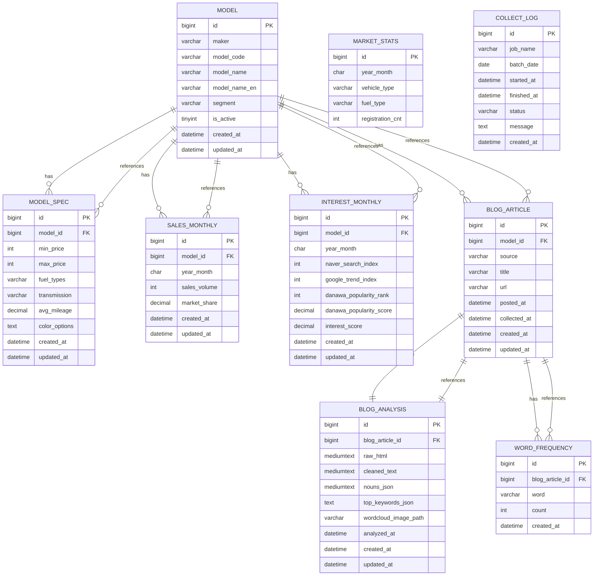

# 국내 자동차 시장 트렌드 분석 – DB 스키마 및 ERD (초안)

이 문서는 하루 1회 배치 ETL을 전제로 한 관계형 DB 스키마 초안과 ERD를 정의한다.  
실제 API 응답 및 크롤링 구조를 확인하면서 컬럼은 추후 조정될 수 있다.

---

## 1. ERD (논리 구조)



---

## 2. 테이블 정의 (DDL 초안)

아래 스키마는 MySQL 기준으로 작성되었으며, 컬럼 타입과 인덱스는 실제 데이터 구조를 보면서 조정할 수 있다.

### 2-1. 모델 기본 정보: `model`

```sql
CREATE TABLE model (
    id             BIGINT AUTO_INCREMENT PRIMARY KEY,
    maker          VARCHAR(20)  NOT NULL,    -- 'HYUNDAI', 'KIA'
    model_code     VARCHAR(50)  NOT NULL,    -- 현대/기아 API 기준 코드 또는 내부 코드
    model_name     VARCHAR(100) NOT NULL,    -- 정규화된 모델명 (예: '아반떼')
    model_name_en  VARCHAR(100) NULL,
    segment        VARCHAR(50)  NULL,        -- 세단, SUV, EV 등
    is_active      TINYINT(1)   NOT NULL DEFAULT 1,

    created_at     DATETIME     NOT NULL DEFAULT CURRENT_TIMESTAMP,
    updated_at     DATETIME     NOT NULL DEFAULT CURRENT_TIMESTAMP ON UPDATE CURRENT_TIMESTAMP,

    UNIQUE KEY uq_maker_model_code (maker, model_code),
    KEY idx_model_name (model_name)
);
```

---

### 2-2. 모델 스펙 정보: `model_spec`

```sql
CREATE TABLE model_spec (
    id             BIGINT AUTO_INCREMENT PRIMARY KEY,
    model_id       BIGINT       NOT NULL,

    min_price      INT          NULL,
    max_price      INT          NULL,
    fuel_types     VARCHAR(100) NULL,   -- 첫 버전은 '가솔린,디젤,하이브리드' 같은 CSV 허용
    transmission   VARCHAR(50)  NULL,
    avg_mileage    DECIMAL(5,2) NULL,   -- 연비
    color_options  TEXT         NULL,   -- 색상 리스트 (JSON 또는 CSV)

    created_at     DATETIME     NOT NULL DEFAULT CURRENT_TIMESTAMP,
    updated_at     DATETIME     NOT NULL DEFAULT CURRENT_TIMESTAMP ON UPDATE CURRENT_TIMESTAMP,

    CONSTRAINT fk_model_spec_model
        FOREIGN KEY (model_id) REFERENCES model(id),

    KEY idx_model_spec_model (model_id)
);
```

추후 스펙을 더 세분화할 경우 `fuel_type` / `color`를 별도 테이블로 분리할 수 있다.

---

### 2-3. 월별 판매량 및 보급률: `sales_monthly`

```sql
CREATE TABLE sales_monthly (
    id             BIGINT AUTO_INCREMENT PRIMARY KEY,
    model_id       BIGINT      NOT NULL,
    year_month     CHAR(7)     NOT NULL,   -- 'YYYY-MM'

    sales_volume   INT         NOT NULL,   -- 다나와 판매실적 (월 출고량 근사치)
    market_share   DECIMAL(7,4) NULL,      -- (해당 모델 판매량 / 전체 판매량) * 100, 배치에서 계산

    created_at     DATETIME    NOT NULL DEFAULT CURRENT_TIMESTAMP,
    updated_at     DATETIME    NOT NULL DEFAULT CURRENT_TIMESTAMP ON UPDATE CURRENT_TIMESTAMP,

    CONSTRAINT fk_sales_monthly_model
        FOREIGN KEY (model_id) REFERENCES model(id),

    UNIQUE KEY uq_sales_model_month (model_id, year_month),
    KEY idx_sales_month (year_month)
);
```

---

### 2-4. 월별 관심도 지표: `interest_monthly`

```sql
CREATE TABLE interest_monthly (
    id                       BIGINT AUTO_INCREMENT PRIMARY KEY,
    model_id                 BIGINT       NOT NULL,
    year_month               CHAR(7)      NOT NULL,  -- 'YYYY-MM'

    naver_search_index       INT          NULL,      -- 네이버 데이터랩 지수 또는 검색량
    google_trend_index       INT          NULL,      -- 0~100 상대 지수

    danawa_popularity_rank   INT          NULL,      -- 다나와 인기순 순위 (1위, 2위 ...)
    danawa_popularity_score  DECIMAL(5,4) NULL,      -- 순위를 0~1로 변환한 값

    interest_score           DECIMAL(7,4) NULL,      -- 가중합으로 계산한 관심도 (배치에서 계산)

    created_at               DATETIME     NOT NULL DEFAULT CURRENT_TIMESTAMP,
    updated_at               DATETIME     NOT NULL DEFAULT CURRENT_TIMESTAMP ON UPDATE CURRENT_TIMESTAMP,

    CONSTRAINT fk_interest_monthly_model
        FOREIGN KEY (model_id) REFERENCES model(id),

    UNIQUE KEY uq_interest_model_month (model_id, year_month),
    KEY idx_interest_month (year_month)
);
```

관심도 산식은 배치 ETL 코드에서 구현하며, 이 테이블은 이미 계산된 값을 캐시하는 용도로 사용한다.

---

### 2-5. 공공데이터 기반 시장 통계: `market_stats`

```sql
CREATE TABLE market_stats (
    id               BIGINT AUTO_INCREMENT PRIMARY KEY,
    year_month       CHAR(7)     NOT NULL,    -- 'YYYY-MM'

    vehicle_type     VARCHAR(50) NOT NULL,    -- '승용', '승합', '화물' 등
    fuel_type        VARCHAR(50) NOT NULL,    -- '가솔린', '디젤', '전기', '하이브리드' 등
    registration_cnt INT         NOT NULL,    -- 등록 대수

    created_at       DATETIME    NOT NULL DEFAULT CURRENT_TIMESTAMP,
    updated_at       DATETIME    NOT NULL DEFAULT CURRENT_TIMESTAMP ON UPDATE CURRENT_TIMESTAMP,

    UNIQUE KEY uq_market_month_type_fuel (year_month, vehicle_type, fuel_type),
    KEY idx_market_month (year_month)
);
```

전체 시장 트렌드 페이지에서 연료별, 차종별, 기간별 흐름 분석에 사용한다.

---

### 2-6. 블로그 메타 정보: `blog_article`

```sql
CREATE TABLE blog_article (
    id             BIGINT AUTO_INCREMENT PRIMARY KEY,
    model_id       BIGINT      NOT NULL,
    source         VARCHAR(20) NOT NULL DEFAULT 'NAVER_BLOG',

    title          VARCHAR(255) NOT NULL,
    url            VARCHAR(500) NOT NULL,

    posted_at      DATETIME     NULL,       -- 글 작성일 (파싱에 성공한 경우)
    collected_at   DATETIME     NOT NULL,   -- 우리가 수집한 시점

    created_at     DATETIME     NOT NULL DEFAULT CURRENT_TIMESTAMP,
    updated_at     DATETIME     NOT NULL DEFAULT CURRENT_TIMESTAMP ON UPDATE CURRENT_TIMESTAMP,

    CONSTRAINT fk_blog_article_model
        FOREIGN KEY (model_id) REFERENCES model(id),

    KEY idx_blog_model (model_id),
    KEY idx_blog_collected (collected_at)
);
```

이 테이블은 네이버 검색 API 등에서 얻은 메타 데이터만 저장한다.  
본문 전체 텍스트와 분석 결과는 별도 `blog_analysis` 테이블에 저장한다.

---

### 2-7. 블로그 본문 및 분석 결과: `blog_analysis`

```sql
CREATE TABLE blog_analysis (
    id                    BIGINT AUTO_INCREMENT PRIMARY KEY,
    blog_article_id       BIGINT      NOT NULL,

    raw_html              MEDIUMTEXT  NULL,  -- 크롤링한 원본 HTML (필요시)
    cleaned_text          MEDIUMTEXT  NULL,  -- HTML 제거 및 전처리 후 텍스트
    nouns_json            MEDIUMTEXT  NULL,  -- 명사 리스트 (JSON)
    top_keywords_json     TEXT        NULL,  -- {단어: count} 상위 N개 JSON

    wordcloud_image_path  VARCHAR(500) NULL, -- 워드클라우드 PNG 파일 경로
    analyzed_at           DATETIME     NOT NULL,

    created_at            DATETIME     NOT NULL DEFAULT CURRENT_TIMESTAMP,
    updated_at            DATETIME     NOT NULL DEFAULT CURRENT_TIMESTAMP ON UPDATE CURRENT_TIMESTAMP,

    CONSTRAINT fk_blog_analysis_article
        FOREIGN KEY (blog_article_id) REFERENCES blog_article(id),

    UNIQUE KEY uq_blog_analysis_article (blog_article_id)
);
```

워드클라우드 이미지는 파일 시스템 또는 객체 스토리지에 저장하고, DB에는 경로만 저장한다.

---

### 2-8. 단어별 빈도 정보: `word_frequency` (선택)

```sql
CREATE TABLE word_frequency (
    id              BIGINT AUTO_INCREMENT PRIMARY KEY,
    blog_article_id BIGINT       NOT NULL,
    word            VARCHAR(100) NOT NULL,
    count           INT          NOT NULL,

    created_at      DATETIME     NOT NULL DEFAULT CURRENT_TIMESTAMP,

    CONSTRAINT fk_word_frequency_article
        FOREIGN KEY (blog_article_id) REFERENCES blog_article(id),

    UNIQUE KEY uq_word_per_article (blog_article_id, word),
    KEY idx_word (word)
);
```

`top_keywords_json`만으로 충분하다면 이 테이블은 생략할 수 있다.  
대신 특정 키워드로 역검색하거나, 단어 전체 분포 분석을 할 계획이 있다면 유지하는 것이 좋다.

---

### 2-9. 배치 수집 로그: `collect_log`

```sql
CREATE TABLE collect_log (
    id               BIGINT AUTO_INCREMENT PRIMARY KEY,
    job_name         VARCHAR(100) NOT NULL,  -- 'fetch_hyundai_api', 'fetch_danawa_sales' 등
    batch_date       DATE         NOT NULL,

    started_at       DATETIME     NOT NULL,
    finished_at      DATETIME     NULL,
    status           VARCHAR(20)  NOT NULL,  -- 'RUNNING', 'SUCCESS', 'FAILED'
    message          TEXT         NULL,      -- 에러 내용 또는 요약

    created_at       DATETIME     NOT NULL DEFAULT CURRENT_TIMESTAMP,

    KEY idx_collect_job_date (job_name, batch_date)
);
```

하루 1회 배치 실행 현황을 추적하고, 실패 시 위치를 빠르게 파악하기 위한 용도다.

---

## 3. 정리

- 위 스키마는 현대/기아 API, 다나와 판매실적과 인기순, 네이버 데이터랩, 구글 트렌드, 네이버 블로그를 하루 1회 배치로 수집한다는 전제를 기반으로 한다.
- `interest_score`, `market_share`, `danawa_popularity_score` 등 계산 가능한 값은 ETL 단계에서 계산하여 DB에 저장한다.
- 블로그 본문은 `blog_analysis.cleaned_text` 기준으로 분석한다. `blog_article`는 메타 정보만 저장한다.
- 실제 구현 시 각 API 응답 구조와 크롤링 결과를 확인하면서 컬럼과 타입은 유연하게 조정한다.
