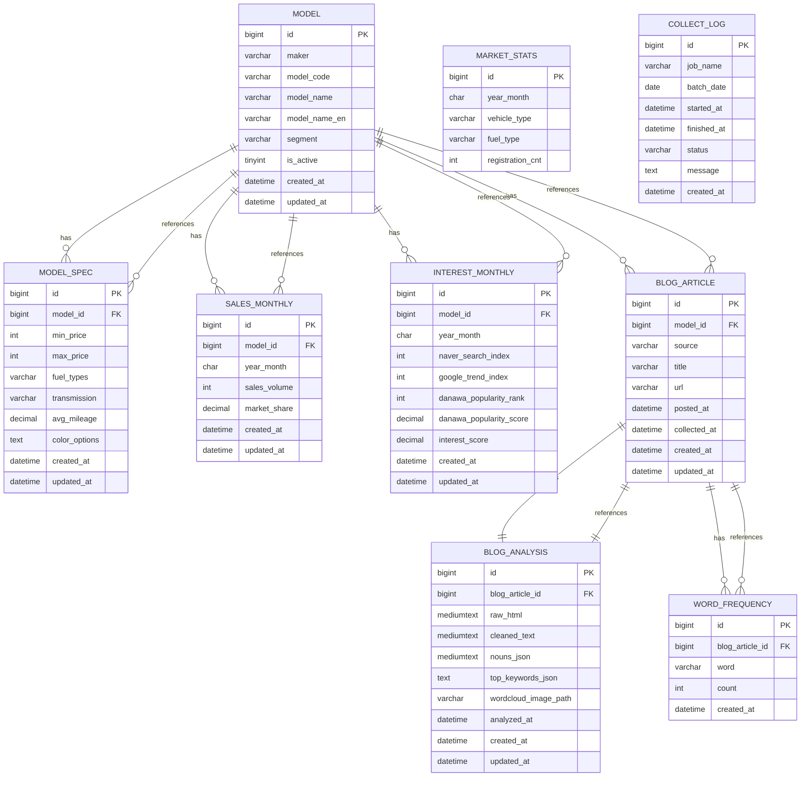

```mermaid
erDiagram

    MODEL ||--o{ MODEL_SPEC : has
    MODEL ||--o{ SALES_MONTHLY : has
    MODEL ||--o{ INTEREST_MONTHLY : has
    MODEL ||--o{ BLOG_ARTICLE : has

    BLOG_ARTICLE ||--|| BLOG_ANALYSIS : has
    BLOG_ARTICLE ||--o{ WORD_FREQUENCY : has

    MARKET_STATS {
        bigint id PK
        char year_month
        varchar vehicle_type
        varchar fuel_type
        int registration_cnt
    }

    MODEL {
        bigint id PK
        varchar maker
        varchar model_code
        varchar model_name
        varchar model_name_en
        varchar segment
        tinyint is_active
        datetime created_at
        datetime updated_at
    }

    MODEL_SPEC {
        bigint id PK
        bigint model_id FK
        int min_price
        int max_price
        varchar fuel_types
        varchar transmission
        decimal avg_mileage
        text color_options
        datetime created_at
        datetime updated_at
    }

    SALES_MONTHLY {
        bigint id PK
        bigint model_id FK
        char year_month
        int sales_volume
        decimal market_share
        datetime created_at
        datetime updated_at
    }

    INTEREST_MONTHLY {
        bigint id PK
        bigint model_id FK
        char year_month
        int naver_search_index
        int google_trend_index
        int danawa_popularity_rank
        decimal danawa_popularity_score
        decimal interest_score
        datetime created_at
        datetime updated_at
    }

    BLOG_ARTICLE {
        bigint id PK
        bigint model_id FK
        varchar source
        varchar title
        varchar url
        datetime posted_at
        datetime collected_at
        datetime created_at
        datetime updated_at
    }

    BLOG_ANALYSIS {
        bigint id PK
        bigint blog_article_id FK
        mediumtext raw_html
        mediumtext cleaned_text
        mediumtext nouns_json
        text top_keywords_json
        varchar wordcloud_image_path
        datetime analyzed_at
        datetime created_at
        datetime updated_at
    }

    WORD_FREQUENCY {
        bigint id PK
        bigint blog_article_id FK
        varchar word
        int count
        datetime created_at
    }

    COLLECT_LOG {
        bigint id PK
        varchar job_name
        date batch_date
        datetime started_at
        datetime finished_at
        varchar status
        text message
        datetime created_at
    }

    MODEL_SPEC }o--|| MODEL : references
    SALES_MONTHLY }o--|| MODEL : references
    INTEREST_MONTHLY }o--|| MODEL : references
    BLOG_ARTICLE }o--|| MODEL : references
    BLOG_ANALYSIS ||--|| BLOG_ARTICLE : references
    WORD_FREQUENCY }o--|| BLOG_ARTICLE : references
```